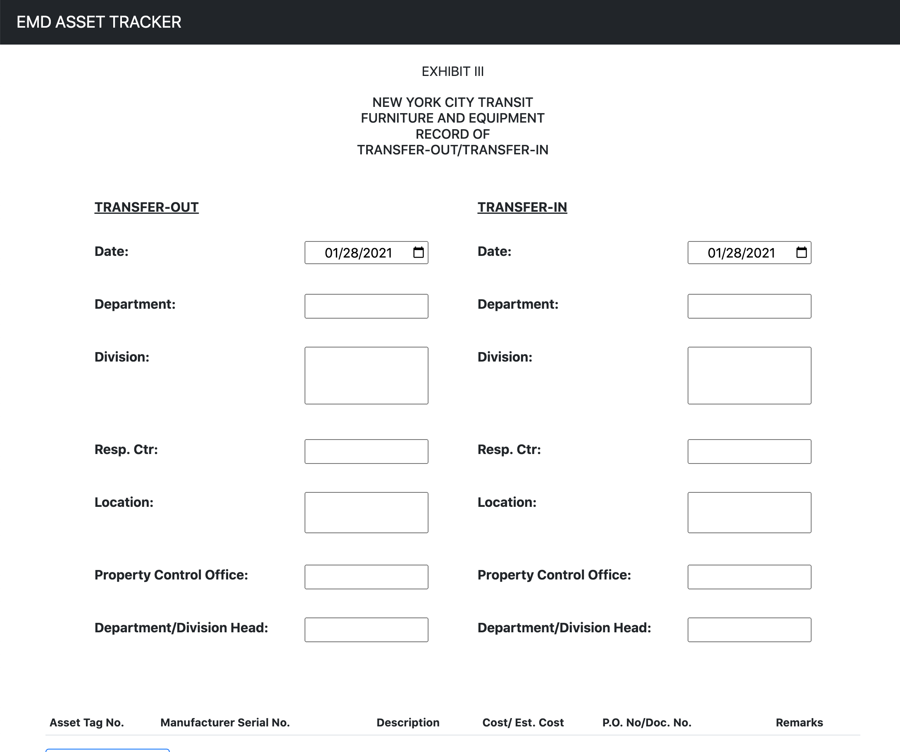
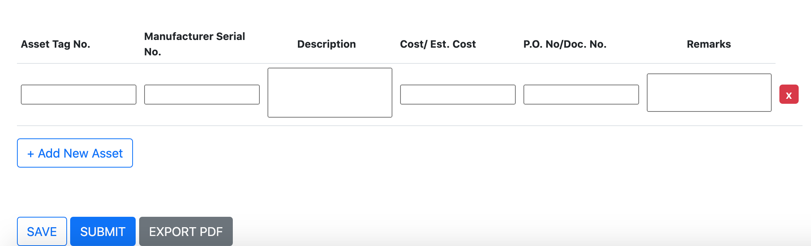
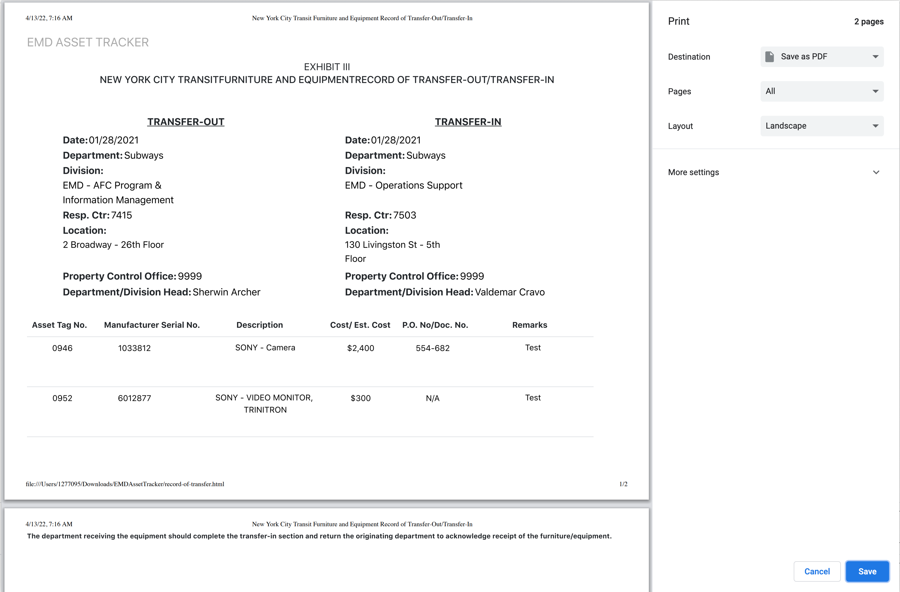

# EMDAssestTracker for the MTA

During my current internship, I have worked to create an asset tracker for the MTA. My duties included creating:
* The Front End
* The Back End
* The Database 
To hold all the incoming assests for the Emergency Maintenance Department. 

In order to submit any sort of data in the form, all parts of the form are required and must be completed and filled out.

Some functionalities include a: 

* A Save button which updates/patches the users information when a new row is added
* A Submit button which updates the system to be approved by a different authorized user
* An Export to PDF, which can convert the webapage to a printable pdf document
* A remove button to delete rows
* An Add New Asset button which can add a blank row to the table 

